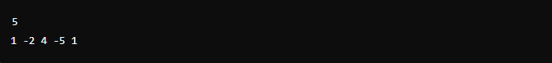

# Identificar quantidade de arrays com soma negativa

Descrição do desafio de código:

- Subarray: Um subarray é um bloco contínuo de elementos de um array. Por exemplo, se o array é 
𝐴 = [1,−2,4,−5,1], os subarrays possíveis são formados por elementos contíguos, como [1], [−2], [4], [1,−2],[−2,4], etc.
- Soma de um array: A soma de um subarray é a soma de todos os seus elementos. Um subarray é considerado negativo se a soma dos seus elementos for negativa.

### Formato de Entrada
- A primeira linha contém um número inteiro 𝑛, que indica o tamanho do array.
- A segunda linha contém 𝑛 números inteiros separados por espaços, que representam os elementos do array 𝐴.

### Objetivo
O objetivo é encontrar e imprimir o número de subarrays cuja soma é negativa.

### Exemplo de Entrada

### Exemplo de Saída

